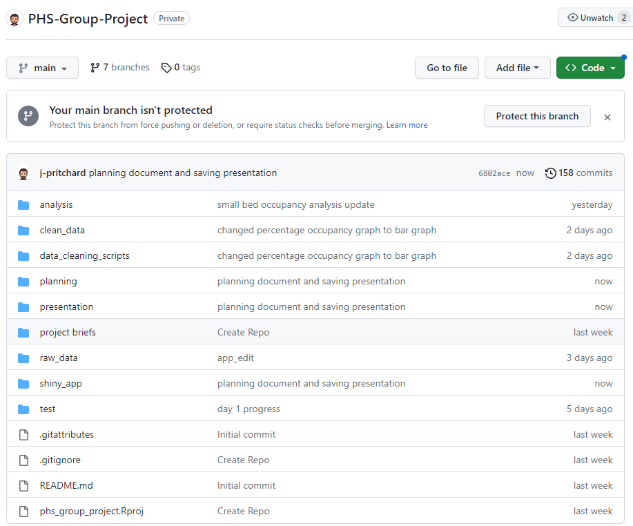
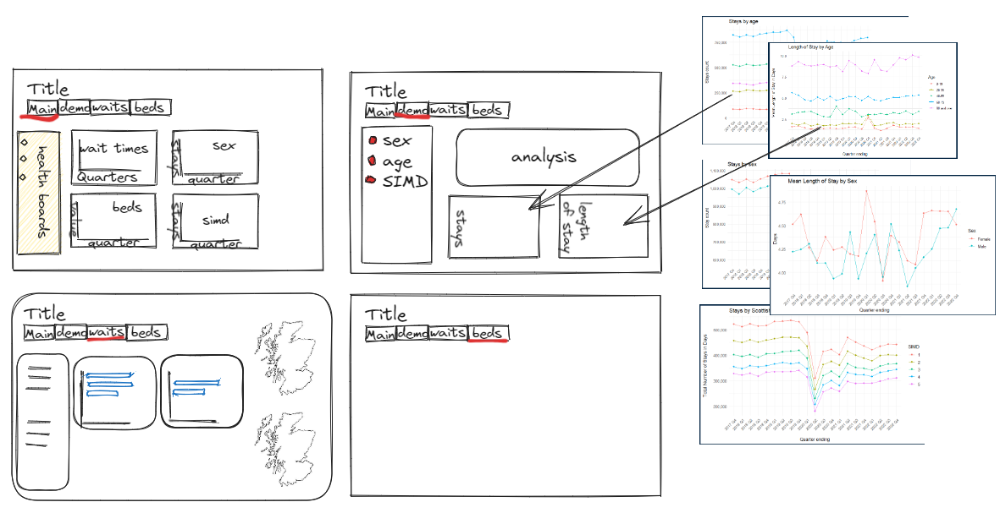
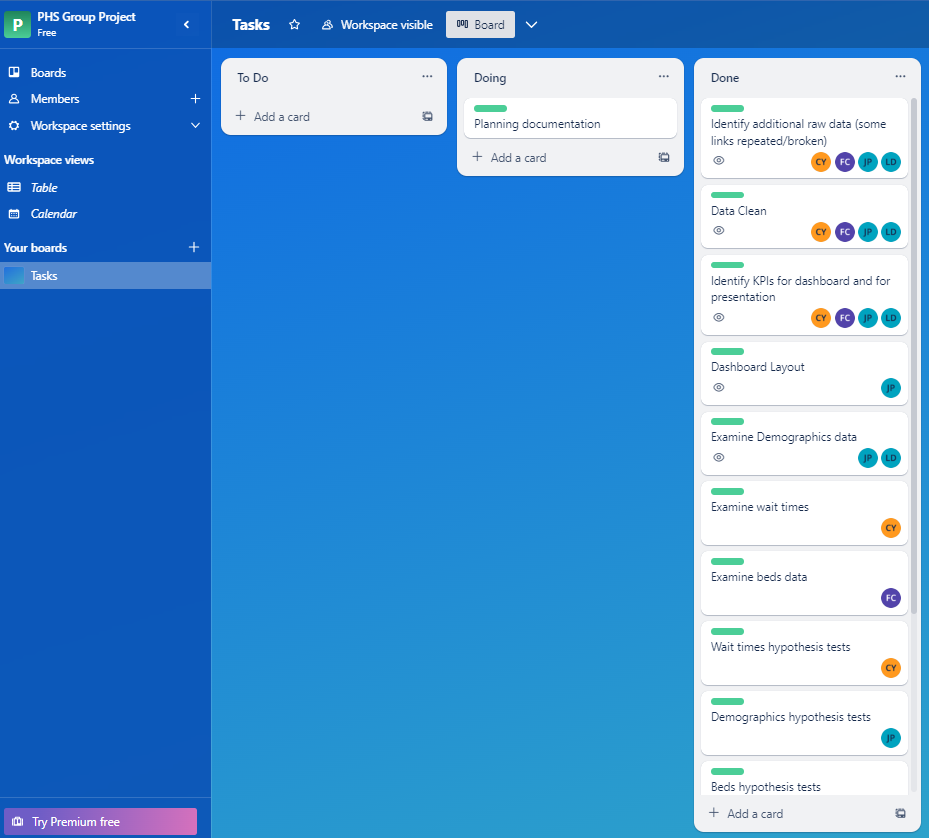

```{r setup, include=FALSE}
knitr::opts_chunk$set(echo = TRUE)
```

### Names of group members

Fergus Cherry, Lesley Duff, James Pritchard, Calum Young

### Roles & responsibilities of each member

**Fergus Cherry** worked on bed occupancy, analysing the effect of COVID-19 and the
winter crisis as well as the ongoing effect since the pandemic. He contributed
a plot for the first page of the shiny app and a separate tab on bed
availability as a KPI.

**Lesley Duff** worked on demographic differences and deprivation. She assisted with
a tab in the shiny app examining effects of the pandemic on different
demographics. Lesley standardised the theme of plots to be used in the various
tabs.

**James Pritchard** worked on Shiny dashboard and demographic differences, including
hypothesis testing where appropriate. Using 'stays' and 'length of stays' as
KPIs he tested demographics looking for changes cause by the pandemic. He set
the layout for the Shiny app, found multipolygons to be used for mapping,
contributed two plots to the front page and put together the tab for
demographics.

**Calum Young** worked on waiting times. Using various waiting time periods as his
KPIs, he was able to look at the winter crises as well as changes in waiting
times since the pandemic. He contributed a plot to the front page of the app as
well as his own tab on waiting times. Plot analysis was bolstered with hypothesis
testing of waiting times between winter months and pre/post-covid quarters.

**Everyone** worked on planning the app, developing their own sections of the
Shiny app, bug-fixing and the presentation.

### Brief description of dashboard topic

Our dashboard contains five tabs.
The first tab is a broad overview. Two plots concern trends in summer and winter
months as well as overall trends across several years, using the KPIs 'bed
occupancy' and 'waiting times'. Two plots are concerned with differences between
demographics using the KPIs 'Stays' and 'Average length of stay'.
The second, third and fourth tabs go into more detail in each of these KPIs.
The final tab is broad information about the project and data sources.

In the project, we looked at the validity of claims that there is a NHS winter
crisis each year and the long term changes to the NHS following the COVID-19
pandemic.

The dashboard outlines our topic in terms of the KPIs:

- bed occupancy
- waiting times
- stays
- average length of stay

### Stages of the project

We started by each choosing data sets that would allow us to identify a suitable
KPI and began to clean those data sets. Some duplication was found in the data
sets, which was typically reduced by carefully filtering certain columns. At an
early stage, a shared git repo was established so that data, cleaning scripts
and analysis could be sensibly collated. A trello Board was established to keep track of tasks that had been identified.

{width=50%}

<br>
We allocated tasks and investigated the data sets further, producing initial
plots to assist in identifying interesting trends. Once we had more idea of how
this was taking shape, we wire-framed the dashboard and began working separately
on our contributions.

{width=50%}

<br>
When we began to bring together our separate pieces of the Shiny app, several
branches were established to help to reduce the number of conflicts arising.
When conflicts did arise, members of the group worked together to help resolve
differences in code.

Once the app had come together, some work was undertaken to carry a common theme
through all plots and menus. At this point we also started to work on our own
sections of the presentation, in "Google Slides".

### Which tools were used in the project

- Zoom: We had twice-daily meetings to check-in on progress and decide next
steps. Other meetings took place ad-hoc when needed.
- Trello: Used initially, to divide tasks. As the app came together it became
less important as everyone understood their role in achieving the goal.
- Excalidraw: to wireframe the app.
- R-Studio: to wrangle data and visualise plots.
- Github: We made regular commits to Github, and worked in branches, which
helped to reduce coding conflicts.
- Google Slides: to put together some presentation slides.

{width=50%}

### How did you gather and synthesise requirements for the project?

We synthesised the information given in the brief by spending part of the first
day making basic visualisations to understand KPIs and how they related to the
key questions in the brief.

We prioritised KPIs that were easy to wrangle that would satisfactorily provide
scope for visualisation and also hypothesis testing to support the various 
conclusions, keeping in mind the reuqirements that had been given to us.

### Motivations for using the data you have chosen

We used the datasets on 'waiting times' and 'bed occupancy' to answer the
question regarding the winter crisis. As well as those KPIs, 'stays' and
'average length of stay' were used as KPIs to compare different demographics.
These measures seemed relevent and easy to manipulate for our analysis.

### Data quality and potential bias, including a brief summary of data cleaning and transformations

The Scottish Health and Social Care open data platform gives access to statistics and reference data for information and re-use. This platform is managed by Public Health Scotland. Data is released under the UK Open Government Licence (OGL) which means it is free to use and re-use.

The dataset may be biased by under-reporting in certain geographical areas or departments and by double-counting some data. Efforts were taken to minimise this effect in each of the data sets.

To clean the datasets we focused on filtering treatment types, so that cumulative categories did not get double-counted in visualisations. Missing entries were generally dealt with appropriately during visualisation rather than being removed in their entirety from the dataset.

https://www.opendata.nhs.scot/dataset/inpatient-and-daycase-activity

### How is the data stored and structured

The raw data was downloaded in the form of CSV files into a "raw data" folder. A CSV file stores tabular data (numbers and text) in plain text. Each line of the file is a data record. Each record consists of one or more fields, separated by commas. The use of the comma as a field separator is the source of the name for this file format. Any text editor, including Excel, can open a csv file. They are relatively small in size, and can be easily imported to R for wrangling. Cleaned data was saved in CSV format, into a "clean data" folder for use in analysis.

### Ethical and legal considerations of the data

Any ethical considerations with the datasets have been dealt with upstream. The data sets have been made openly available by the NHS. While it is possible to identify individual health boards and hospitals, it would be impossible to pinpoint a specific patient or procedure.

The datasets are covered by the Open Government License, which means that the information can by used freely and flexibly, with some conditions. The license can be foud here: https://www.nationalarchives.gov.uk/doc/open-government-licence/version/3/